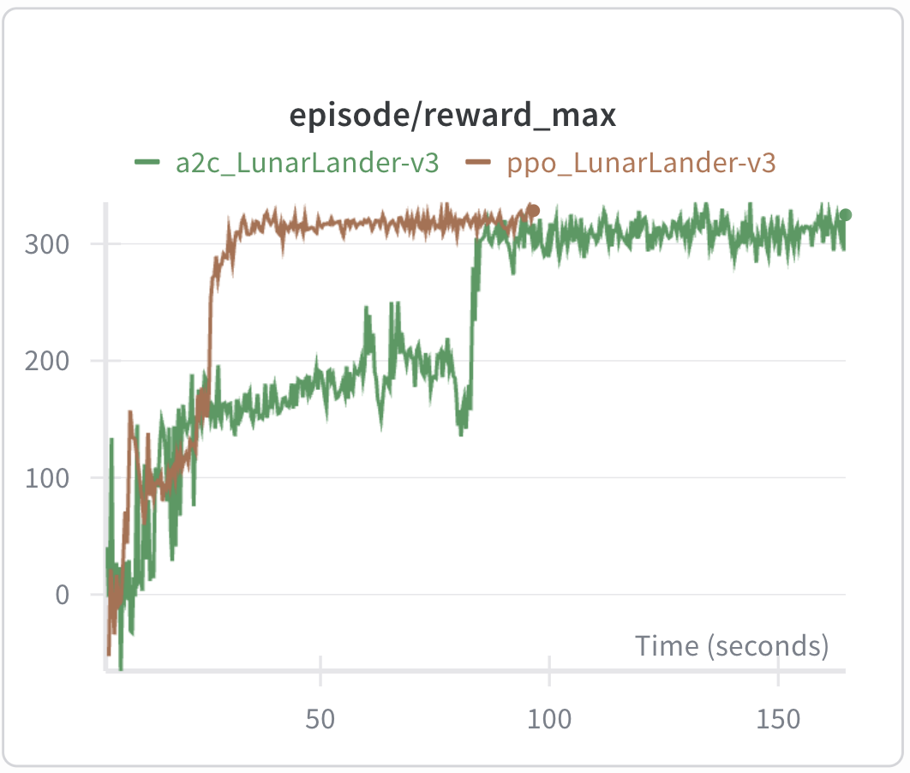

# minimal_flaxrl

Minimal RL implementations in [Flax NNX](https://flax.readthedocs.io/en/latest/index.html), inspired by [minimalRL](https://github.com/seungeunrho/minimalRL). All trained on [LunarLander-v3](https://gymnasium.farama.org/environments/box2d/lunar_lander/).

## Quick Start

```bash
pip install -r requirements.txt   # Python >= 3.12
wandb login                       # for experiment logging
```

## Algorithms

| Algorithm | Lines | Command | Training time (MacBook Air M2)|
|-----------|-------|---------|---------------|
| [PPO](ppo.py) | 218 | `python ppo.py` | ~40 sec |
| [A2C](a2c.py) | 180 | `python a2c.py` | ~100 sec |
| [Impala](impala.py) ([cleanba](https://github.com/vwxyzjn/cleanba) style)| 240 | `python impala.py` | ~100 sec |


If you'd like to see a specific algorithm implemented, feel free to open an [issue](../../issues).

## Tuning Tips

- Training failed with `gamma=0.97`. Setting it to `0.99` was critical for learning.
- Increasing hidden dim from 128 to 256 improved both convergence speed and final performance.
- For A2C, updating the actor with `V` instead of `G - V` (advantage) caused training to fail.

## Performance graph


