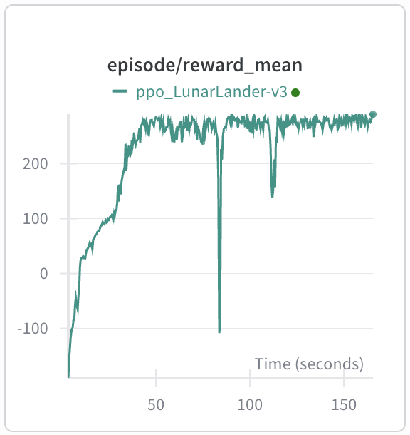

# minimal_flaxrl

Minimal RL implementations in [Flax NNX](https://flax.readthedocs.io/en/latest/index.html), inspired by [minimalRL](https://github.com/seungeunrho/minimalRL).

## Quick Start

```bash
pip install -r requirements.txt   # Python >= 3.12
wandb login                       # for experiment logging
```

## Algorithms

| Algorithm | Lines | Environment | Command |
|-----------|-------|-------------|---------|
| PPO | 218 | [LunarLander-v3](https://gymnasium.farama.org/environments/box2d/lunar_lander/) | `python ppo.py` |


If you'd like to see a specific algorithm implemented, feel free to open an [issue](../../issues).

### PPO

Solves LunarLander-v3 in ~1 min on MacBook Air M2.


